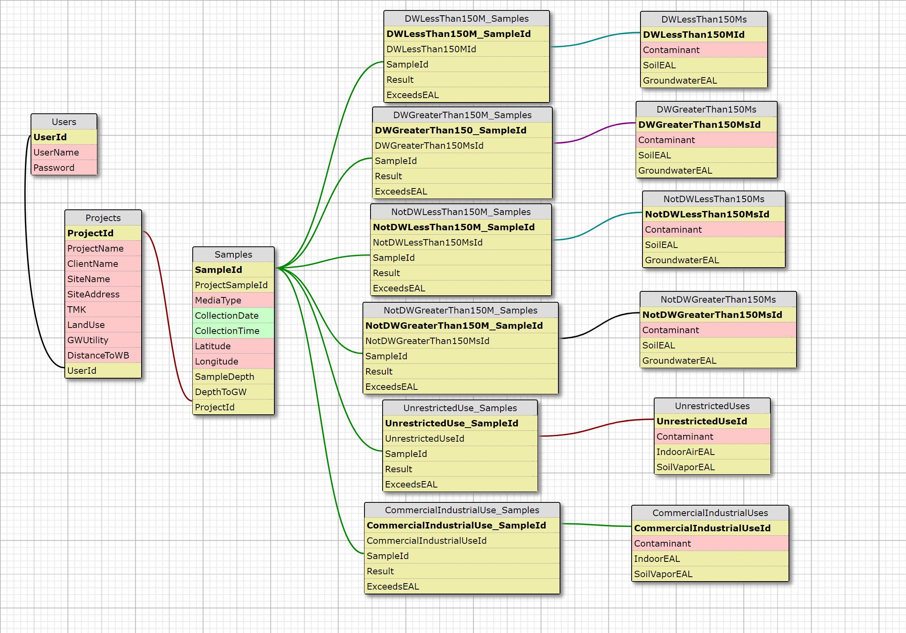

# Hawaii Environmental Action Level Screening Tool

#### By _Kaili Nishihira_

#### _A web app to screen analytical data from environmental samples against the State of Hawaii's established screening criteria, which are known as the Environmental Action Levels, 02.08.18_

## Description

_The use of this web app is for Environmental Consultants who conduct site investigations on properties throughout the State of Hawaii. Environmental Action Levels (EALs) are concentrations of contaminants in soil, soil gas, groundwater and indoor air that are used in decision making throughout the site investigation process._

_The user may create an account to access the web app. The user may create a new project and assign the Site Scenario's three criteria which are: Land Use, Groundwater Utility, and Distance to Nearest Surface Water Body. The user may enter each sample's contaminate results and compare it to the state established EAL._

_For more information on EALs, visit the  [State of Hawaii, Dept. of Health](http://eha-web.doh.hawaii.gov/eha-cma/Leaders/HEER/environmental-hazard-evaluation-and-environmental-action-levels)._

### User Stories

* _As a user, I would like to be able to store my sample data in the database._
* _As an administrator, I would like to be able to edit and delete sample data from the database._
* _As a user, I would like to filter sample results by a given contaminant so I may see how the contaminant concentrations vary throughout the site._
* _As a user, I would like to filter sample results by a given contaminant that exceeds the corresponding EAL, so that I may notify the client of the site areas that may need cleanup._

|| Behavior  | Example Input  | Example Output  |
|---|---|---|---|
|| The user may log in to their existing account | Email: steve@gmail.com   Password: xxxxxxxx   Click `Log In` button | After successfully logging into their account, the user is redirected to the home page |
|| The user may create an account   Click `Sign Up` link | Email: steve@gmail.com   Password: xxxxxxxx    Click `Register` button | After successfully registering a new account, the user is redirected to the login page |
|| The user may log out of their account | Click `Log Out` on the navigation bar | The user is redirected to the Login view |
|| The user may create a new project and will be saved in the database   Click `Start new project` | Project Name/Type: ABC Company, Phase II   Client Name: XYZ Company   Site Name: Momo's Grocery Store   Site Address: 123 Coconut Lane, Honolulu, HI 96819   Tax Map Key (TMK) #: (1) 2-3-456-789-0000    *Project Site Scenario*  Land Use: Unrestricted   Groundwater Utility: Drinking Water Resource   Distance to Nearest Surface Water Body: < 150 m   Enter by: Steve Smith   Click `Submit` | The user is redirected to the Project Details view where the project details are displayed |
|| The user may edit the Project's details   Click `Edit` on the Project's Details view | Project Name: ABC Company, Phase III   Click `Update` | The user is redirected to the Project Details view where the updated project details are displayed |
|| The user may delete the Project | Click `Delete Project` on the Project Details view   The user is directed to a Delete Confirmation view   Click `Delete Project` | The Project is deleted and user is redirected to the Home view |
|| The user may add a Sample to the project and it will be saved in the database   Click `Add Sample` (the corresponding Sample Media Type) on the Project Details view    Note: If Sample Media Type is Soil or Soil Vapor, Sample Depth results are needed. If Sample Media Type is Groundwater, Depth to Groundwater results are needed. | Project Sample ID#: SS1   Sample Media Type: Soil (select from dropdown list)   Collection Date: 07/03/2017   Collection Time: 2:05PM   Latitude (optional): x   Longitute (optional): y   Sample Depth (feet below ground surface): 10.2   Click `Add Sample to Project` | The user is redirected to the Sample Details page with the sample details are listed |
|| The user may add the Sample's results for each contaminant's concentration | On the Sample Details view, click on drop down menu and select `Zinc` (contaminant name)   Actual Results (mg/kg): 10.1   Click `Submit`| The sample results will appear on the Sample Details view |
|| The Sample results will be screened against the EAL based on Sample Media Type and the Project's Site Scenario and saved in a join table in the database | *Project Site Scenario*   Land Use: Unrestricted   Groundwater Utility: Drinking Water Resource   Distance to Nearest Surface Water Body: < 150 m    Sample Media Type: Soil   Contaminant: Zinc   Result(mg/kg): 10.1    **Screened against DWLessThan150Ms (Groundwater is current or potential source of drinking water, and is less than or equal to 150 meters to surface water body) Table for Soil EAL**    Soil EAL(mg/kg): 4100 | The contaminant result is less than the EAL |
|| The user may add the selected Sample's results for additional contaminants |  On the Sample Details view, click on drop down menu and select `Nickel` (contaminant name)   Actual Results (mg/kg): 20.2   Click `Submit` | The Sample results will appear on the Sample Details view, along with the other Sample results |
|| The user may add additional Samples to the project   On the Project Details view, click `Add Sample` | Project Sample ID#: SS2   Sample Media Type: Soil (select from dropdown list)   Collection Date: 07/02/2017   Collection Time: 1:25PM   Latitude (optional): x   Longitute (optional): y   Sample Depth (feet): 10.5   Click `Add Sample to Project` | The user is redirected to the Sample Details page with the sample details are listed |
|| The user may update the Sample's actual results   Click `Edit` on the Sample Details view | Project Sample ID#: SS1   Contaminant: Nickel   Actual Results (mg/kg): 22.5   Click `Update` | The sample results will appear on the Sample Details view, along with the other Sample results |  
|| The user may delete a Sample's results | Click `Delete Sample Results` next to selected Sample on the Sample Details view   The user is directed to a Delete Confirmation view   Click `Delete Sample Result` | The Sample Result is deleted |
|| The user may filter Sample results to display all Samples equal to or greater than the EALs | Click `Contaminant Exceedances` on the Project Details view |  A list of Samples with Contaminant Exceedances will be displayed |

## SQL Design

## Setup/Installation Requirements

* _Download and install [.NET Core 1.1 SDK](https://www.microsoft.com/net/download/core)_
* _Download and install [MAMP](https://www.mamp.info/en/)_
* _Download and install [Visual Studio 2017](https://www.visualstudio.com/)_
* _Clone repository_

### Setup/Installation for Database

* Set MySQL Port number in appsettings.json
* In your terminal, navigate from the Solution folder to the project folder, EALScreeningTool
* Enter `dotnet restore` from the command line
* Enter `dotnet ef database udpate` from the command line

### Import data from the Cloned Repository

* _Click 'Open start page' in MAMP_
* _Under 'Tools', select 'phpMyAdmin'_
* _Click 'Import' tab_
* _Choose database file (from cloned repository folder)_
* _Click 'Go'_

## Technologies Used

* _C#_
* _.NET_
* _MVC_
* _Entity Framework_
* _[Bootstrap](http://getbootstrap.com/getting-started/)_
* _[MySQL](https://www.mysql.com/)_

## Known Bugs

_None._

## Support and contact details

_Contributions are always welcome! Please contact Kaili Nishihira at kailinishihira@gmail.com_

### License

Copyright (c) 2018 **_Kaili Nishihira_**

*Licensed under the [MIT License](https://opensource.org/licenses/MIT)*


